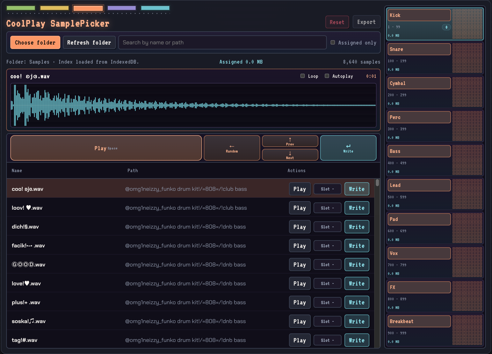

# Sample Picker MVP

Small local prototype for a browser-based sample browsing app.

## Setup

1. `npm install`
2. `npm run dev`
3. Open the local URL shown in Chrome or Edge
4. Click `Choose folder` and grant access to your sample folder

## Notes

- The app uses the File System Access API and is intended for current desktop versions of Chrome or Edge.
- The index and saved sample assignments are stored in IndexedDB in the browser.
- `Refresh folder` rescans the most recently selected folder.
- Only `.wav` files are indexed.

## GitHub Pages Deployment

- The repository is prepared for GitHub Pages deployment via GitHub Actions.
- In GitHub, go to `Settings -> Pages` and choose `GitHub Actions` as the source.
- After that, every push to `main` will automatically deploy the static site.
- For this repository, the app is expected at `https://frankthefurter.github.io/CoolPlay-SamplePicker/` as long as the repository name stays the same.
